# 中车考核管理工具设计文档

## 一、项目概述

### 1.1 项目名称
中车考核管理工具（NewZCAdmin）

### 1.2 项目背景
- **业务背景**：中车集团职业技能考核、职业认定、竞赛及模拟考核的管理平台，需支撑考核业务全流程（题库、组卷、考试、成绩、证书等），传统人工管理方式已无法满足高效、准确、可追溯的管理需求。
- **技术背景**：Vue 3 + Vite + Element Plus 前端；组件切换式页面导航（activeView 非 SPA 路由）；JWT Token 认证；需与后端 API 对接。
- **市场背景**：考核业务规范化和信息化管理需求提升，需多角色协同、流程可追溯。

### 1.3 项目目标
- **主要目标**：实现考核申请→组卷→审卷→派发→阅卷→成绩→证书全流程自动化管理，支持职业认定、竞赛、模拟考核等类型。
- **次要目标**：多角色权限控制、操作日志、数据导入导出、线上线下考试、成绩分析。
- **可量化指标**：系统响应时间小于 2 秒，支持主流浏览器（Chrome/Edge 最新版），首屏加载小于 3 秒。

### 1.4 术语说明
| 术语 | 说明 |
|------|------|
| ruleType | 试卷用途/规则类型：0=职业认定、1=竞赛、2=模拟考核，组卷管理、组卷规则、资源题库中统一使用数值 |
| passScore | 组卷规则达标分数字段 |
| activeView | 主框架 Main.vue 当前显示的视图标识，用于组件切换 |
| 试卷申请 | 考核站管理员提交的试卷申请，包含上传的附件（考试列表文件，支持 xlsx、doc、docx、pdf） |
| 派发记录 | 管理员组卷并审核通过后，将试卷派发给考核站的记录，需关联对应试卷申请 |
| 加密试卷包 | 后端将多张试卷生成 A3/A4 Word 文件后打包成的加密压缩包（如已实现） |
| 解压密码 | 用于解密试卷包的密码，密文存储，仅可查看一次明文（如已实现） |

### 1.5 全局约束规则

| 约束规则 | 说明 | 适用场景 |
|---------|------|----------|
| 职工编号来源约束 | 考试人员涉及的职工编号须来源于职工列表，不存在时禁止添加或导入并给出明确提示 | 考试人员新增、导入、成绩录入 |
| 职工信息自动获取 | 输入职工编号后自动获取姓名、部门、职业、技能等级等，不允许手动修改 | 考试人员新增、编辑 |
| 职工状态校验 | 添加考试人员时需校验职工状态是否为"在职"，离职或禁用状态不允许添加 | 考试人员新增、导入 |
| ruleType 统一规范 | 职业认定/竞赛/模拟考核统一使用 0/1/2 数值 | 组卷管理、组卷规则、资源题库 |

---

## 二、需求分析

### 2.1 功能需求

#### 2.1.1 详细功能需求表

| 模块名称 | 子模块名称 | 功能描述 | 优先级 | 关联需求编号 | 输入 | 输出 | 前置条件 | 后置条件 |
|---------|-----------|---------|-------|------------|------|------|---------|---------|
| 账号管理 | 管理员列表 | 支持按用户名、角色等条件查询管理员列表，显示序号、账号、管理员姓名、角色、考核站、创建时间。支持新增、编辑、删除操作。新增时密码与确认密码默认为 Aa123456；两者均为默认未修改时校验通过，若修改密码则两次输入须一致。编辑包含登录账号、管理员姓名、修改密码、角色、考核站、状态。 | 高 | ACC-001 | 查询条件/管理员信息 | 管理员列表/操作结果 | 用户已登录且为管理(5)/总管理(6) | 查询结果返回/管理员信息更新 |
| 账号管理 | 职工列表 | 支持按用户名、考核站、部门等条件查询职工列表，显示用户名称、工号、性别、部门、职业（工种）、技能等级、考核站、创建时间。支持新增、编辑、修改密码、删除操作。支持导入职工信息和批量下载。 | 高 | ACC-002 | 查询条件/职工信息 | 职工列表/操作结果 | 用户已登录 | 查询结果返回/职工信息更新 |
| 考核站管理 | 考核站管理 | 支持按考核站名称查询考核站列表，显示序号、考核站名称、排序号、状态、说明、创建时间。支持新增、编辑、启用、禁用、绑定管理员操作。编辑包含考核站名称、排序号、状态、考核站说明。 | 高 | STA-001 | 查询条件/考核站信息 | 考核站列表/操作结果 | 用户已登录且为管理(5)/总管理(6) | 查询结果返回/考核站信息更新 |
| 字典管理 | 职业/技能等级/题型 | 支持查看职业（工种）、技能等级、题型类别列表，支持按名称搜索。支持新增、编辑、删除操作。 | 中 | DIC-001~003 | 字典信息 | 列表/操作结果 | 用户已登录且为管理(5)/总管理(6) | 字典信息更新 |
| 部门管理 | 部门管理 | 支持查看部门树形列表，显示部门编码、部门名称、层级、排序、状态。支持新增、编辑、删除操作。 | 中 | DEP-001 | 部门信息 | 部门列表/操作结果 | 用户已登录且为管理(5)/总管理(6) | 部门信息更新 |
| 组卷规则 | 组卷规则 | 支持查看组卷规则列表，显示ID、技能等级、职业道德、基础知识、专业知识、类型、默认、达标分数、备注。类型包含职业认定、竞赛、模拟考核（ruleType 0/1/2）。支持新增、编辑、删除操作。 | 中 | RUL-001 | 规则信息 | 规则列表/操作结果 | 用户已登录且为管理(5)/总管理(6) | 规则信息更新 |
| 资源题库 | 题库管理 | 支持按职业（工种）、技能等级、题库类型查询题库列表，题库类型包含竞赛、模拟考试、职业认定。显示序号、题库名称、题库类型、职业（工种）、技能等级、考核站、管理人、创建时间。支持查看题目、删除、导入题库操作。查看题库中支持新增题目。考核站管理员只可导入竞赛题库、在竞赛题库中新增题目。 | 高 | QST-001 | 题库信息 | 题库列表/操作结果 | 用户已登录 | 题库更新 |
| 组卷管理 | 组卷管理 | 支持按职业（工种）、技能等级、创建时间、审核状态查询试卷列表，显示序号、名称、试卷ID、职业（工种）、技能等级、创建人、考核站、创建时间、审核状态、试卷用途（ruleType）。支持自动组卷、手动组卷、查看、下载、删除、提交审卷操作。考核站管理员只可组竞赛试卷。 | 高 | PAP-001 | 组卷信息 | 试卷列表/操作结果 | 用户已登录 | 试卷生成/审核/派发 |
| 组卷管理 | 试卷审核 | 审卷专家支持按组卷类型、职业（工种）、技能等级、审核状态查询待审核试卷，支持查看、下载、通过、驳回操作。 | 高 | PAP-002 | 审核操作 | 审核结果 | 用户已登录且为审卷专家(8) | 审核状态更新 |
| 考试管理 | 考试管理 | 支持按考试名称、状态查询考试列表，显示序号、考试名称、职业（工种）、技能等级、开始时间、结束时间、考试时长、关联试卷、考试类型、考试模式、状态、考试人数。点击考试人数跳转报名人员管理。管理(5)/总管理(6)新增或编辑考试时须选择所属考核站（必填），关联试卷在选择考核站后加载，编辑时可修改考核站；考核站管理员可新增考试（线上/线下），线上可派发试卷，线下可关联试卷。 | 高 | EXA-001 | 考试信息 | 考试列表/操作结果 | 用户已登录 | 考试信息更新 |
| 考试管理 | 派发记录 | ① 试卷申请列表（查看/下载）② 派发记录 ③ 批量派发。显示考核站、考试申请、申请时间、派发时间、派发状态。考核站可查看/下载接收的试卷。 | 高 | EXA-002 | 查询条件 | 派发记录列表 | 用户已登录 | 派发记录返回 |
| 考试管理 | 报考人员 | 支持添加、导入、删除、查询报考人员。支持工号、姓名筛选。支持下载模板。管理(5)/总管理(6)新增或导入时须先选择所属考核站；考核站管理员使用当前考核站。新增时校验职工编号须在职工列表中存在。 | 高 | EXA-003 | 报考人员信息 | 报考人员列表/操作结果 | 用户已登录 | 报考信息更新 |
| 试卷申请 | 试卷申请 | 支持新增试卷申请，包含上传考试列表（xlsx、doc、docx、pdf，最大10MB）、备注说明。支持查看、删除操作。管理(5)/总管理(6)/考核站(4)可见。 | 高 | APP-001 | 申请信息/附件 | 申请列表/操作结果 | 用户已登录 | 申请提交成功 |
| 考核成绩 | 成绩管理 | 支持按名称、起止日期查询成绩列表，显示考试名称、考试模式、试题职称等级、总报名人数、通过人数、考试时长、开始时间、结束时间。支持查看成绩分析、线上判分、线下成绩导入。判分状态：已判（蓝）/未判（红）。 | 高 | SCO-001 | 成绩信息 | 成绩列表/操作结果 | 用户已登录 | 成绩更新 |
| 证书管理 | 证书管理 | 支持按证书编号、姓名、状态、考核站、考试名称等查询证书列表，显示序号、证书编号、姓名、工号、考试名称、考核站、状态、发证日期、下证日期、有效期、快递单号、邮寄时间、接收时间、备注。管理员可新增、编辑、删除、标记已邮寄；考核站可确认收到。状态：已录入(0)、已邮寄(1)、已收到(2)。 | 高 | CER-001 | 证书信息 | 证书列表/操作结果 | 用户已登录 | 证书状态更新 |
| 技能考核 | 技能考核 | 支持按考核站、考试类型查询技能考核列表，显示序号、考核站、考试类型、考试时间、考试名称、上传人。管理员支持上传、查看、下载、删除技能考核试卷文件。 | 高 | SKI-001 | 考核信息/文件 | 技能考核列表/操作结果 | 用户已登录且为管理(5)/总管理(6) | 考核信息更新 |
| 日志监控 | 日志监控 | 支持查看操作人列表，显示操作人、角色、账号、详情。点击查看可查看该操作人的具体日志信息，包含时间和动作。 | 中 | LOG-001 | 查询条件 | 日志列表 | 用户已登录且为管理(5)/总管理(6) | 日志返回 |

#### 2.1.2 功能用例图

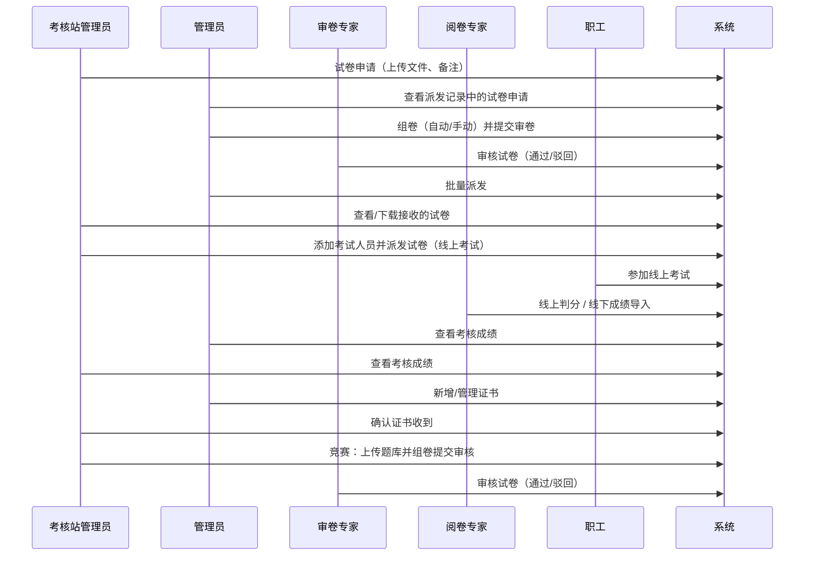
```mermaid
sequenceDiagram
    participant 考核站管理员
    participant 管理员
    participant 审卷专家
    participant 阅卷专家
    participant 职工
    participant 系统

    考核站管理员->>系统: 试卷申请（上传文件、备注）
    管理员->>系统: 查看派发记录中的试卷申请
    管理员->>系统: 组卷（自动/手动）并提交审卷
    审卷专家->>系统: 审核试卷（通过/驳回）
    管理员->>系统: 批量派发
    考核站管理员->>系统: 查看/下载接收的试卷
    考核站管理员->>系统: 添加考试人员并派发试卷（线上考试）
    职工->>系统: 参加线上考试
    阅卷专家->>系统: 线上判分 / 线下成绩导入
    管理员->>系统: 查看考核成绩
    考核站管理员->>系统: 查看考核成绩
    管理员->>系统: 新增/管理证书
    考核站管理员->>系统: 确认证书收到
    考核站管理员->>系统: 竞赛：上传题库并组卷提交审核
    审卷专家->>系统: 审核试卷（通过/驳回）
```

---

## 三、角色设计

### 3.1 角色定义

| 角色ID | 角色名称 | 职责摘要 |
|--------|----------|----------|
| 1 | 阅卷专家 | 线上考试判分；线下考试成绩导入；判分完成后状态为「已判」并有颜色区分 |
| 2 | 命题专家 | 资源题库、组卷管理（题目命题、组卷） |
| 3 | 审题专家 | 资源题库（题目审核） |
| 4 | 考核站管理员 | 试卷申请；派发页查看/下载试卷；证书确认；竞赛时上传竞赛题库、自组卷并提交审核；线上考试添加人员并派发 |
| 5 | 管理 | 派发（申请、记录、批量派发）；组卷；提交审卷；证书管理；技能考核上传；组卷规则；账号管理、考核站、部门、字典等 |
| 6 | 总管理员 | 所有权限 |
| 7 | 组卷专家 | 组卷管理 |
| 8 | 审卷专家 | 组卷管理内审核试卷（通过/驳回） |

---

## 四、功能模块设计

### 4.1 核心功能模块

#### 4.1.1 模块1：账号管理

##### 4.1.1.1 模块概述
- **模块定位**：考核管理工具的基础模块，负责管理员和职工的全生命周期管理。
- **核心职责**：管理员列表管理、职工列表管理、用户信息编辑、密码修改、用户状态管理。
- **依赖关系**：为所有其他模块提供用户认证和权限支持，依赖考核站管理获取考核站信息，依赖部门管理获取部门信息。
- **前端组件**：`views/account/index.vue`、`views/student/index.vue`；activeView：`teacherList`、`student`。

##### 4.1.1.2 功能详细设计

| 功能点 | 描述 | 流程ID | 界面ID | API ID | 可见角色 |
|-------|------|--------|--------|--------|----------|
| 管理员列表查询 | 按用户名、角色等条件查询，显示序号、账号、姓名、角色、考核站、创建时间 | FLW-ACC-001 | PAGE-ACC-001 | API-ACC-001 | 管理(5)、总管理(6) |
| 管理员新增 | 登录账号、管理员姓名、密码、确认密码（默认均为 Aa123456；未修改则视为使用默认，修改则两次须一致）、角色、考核站、状态 | FLW-ACC-002 | PAGE-ACC-002 | API-ACC-002 | 管理(5)、总管理(6) |
| 管理员编辑 | 登录账号、管理员姓名、修改密码、角色、考核站、状态 | FLW-ACC-003 | PAGE-ACC-003 | API-ACC-003 | 管理(5)、总管理(6) |
| 管理员删除 | 删除管理员账号 | FLW-ACC-004 | PAGE-ACC-001 | API-ACC-004 | 管理(5)、总管理(6) |
| 职工列表查询 | 按用户名、考核站、部门等条件查询，显示工号、姓名、性别、部门、职业、技能等级、考核站、创建时间 | FLW-ACC-005 | PAGE-ACC-004 | API-ACC-005 | 所有角色 |
| 职工新增 | 考核站、用户名、工号、性别、部门、职业、技能等级、状态 | FLW-ACC-006 | PAGE-ACC-005 | API-ACC-006 | 管理(5)、总管理(6)、考核站(4) |
| 职工编辑 | 同上 | FLW-ACC-007 | PAGE-ACC-006 | API-ACC-007 | 同上 |
| 职工密码修改 | 职工姓名、工号、新密码、确认密码 | FLW-ACC-008 | PAGE-ACC-007 | API-ACC-008 | 同上 |
| 职工删除 | 删除职工 | FLW-ACC-009 | PAGE-ACC-004 | API-ACC-009 | 同上 |
| 职工导入 | 批量导入职工 | FLW-ACC-010 | PAGE-ACC-004 | API-ACC-010 | 同上 |
| 职工批量下载 | 批量下载职工信息 | FLW-ACC-011 | PAGE-ACC-004 | API-ACC-011 | 同上 |

##### 4.1.1.3 流程图

**管理员管理流程**
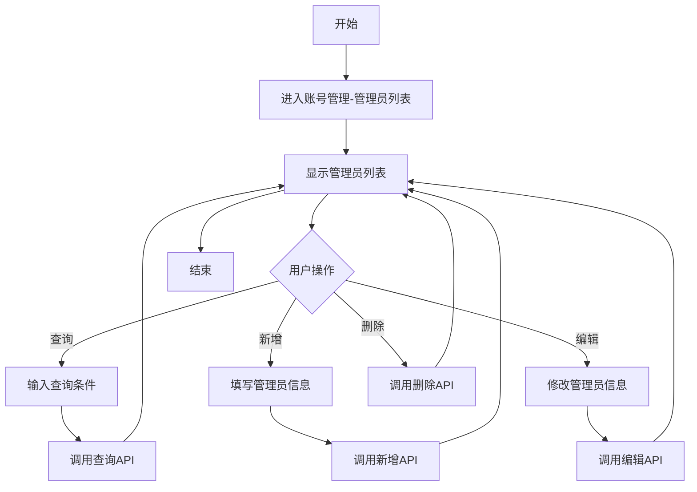
```mermaid
flowchart TD
    A[开始] --> B[进入账号管理-管理员列表]
    B --> C[显示管理员列表]
    C --> D{用户操作}
    D -->|查询| E[输入查询条件] --> F[调用查询API] --> C
    D -->|新增| G[填写管理员信息] --> H[调用新增API] --> C
    D -->|编辑| I[修改管理员信息] --> J[调用编辑API] --> C
    D -->|删除| K[调用删除API] --> C
    C --> L[结束]
```

**职工管理流程**
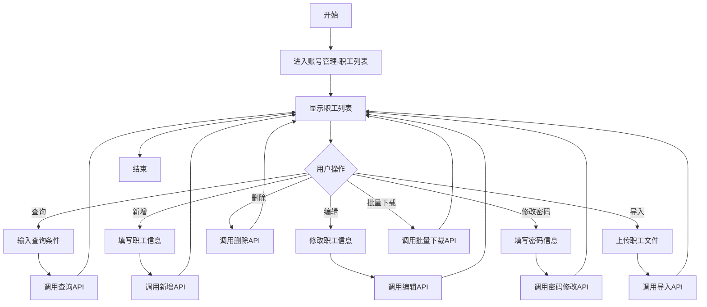
```mermaid
flowchart TD
    A[开始] --> B[进入账号管理-职工列表]
    B --> C[显示职工列表]
    C --> D{用户操作}
    D -->|查询| E[输入查询条件] --> F[调用查询API] --> C
    D -->|新增| G[填写职工信息] --> H[调用新增API] --> C
    D -->|编辑| I[修改职工信息] --> J[调用编辑API] --> C
    D -->|修改密码| K[填写密码信息] --> L[调用密码修改API] --> C
    D -->|删除| M[调用删除API] --> C
    D -->|导入| N[上传职工文件] --> O[调用导入API] --> C
    D -->|批量下载| P[调用批量下载API] --> C
    C --> Q[结束]
```

##### 4.1.1.4 状态转换图

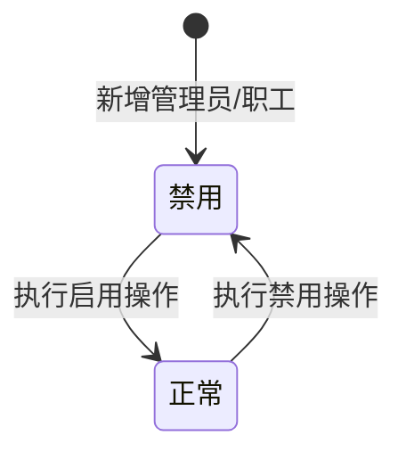
```mermaid
stateDiagram
    [*] --> 禁用 : 新增管理员/职工
    禁用 --> 正常 : 执行启用操作
    正常 --> 禁用 : 执行禁用操作
```

##### 4.1.1.5 规则校验

| 校验规则 | 适用功能点 | 错误提示 |
|---------|----------|----------|
| 登录账号唯一性 | 管理员新增、编辑 | 该登录账号已存在 |
| 工号唯一性 | 职工新增、编辑 | 该工号已存在 |
| 密码长度≥6位 | 管理员/职工密码修改 | 密码长度不能少于6位 |
| 密码一致性 | 密码修改 | 两次输入的密码不一致 |
| 管理员新增密码 | 管理员新增 | 密码与确认密码默认 Aa123456；两者均为默认未修改时通过，若修改则两次须一致，否则提示「两次输入的密码不一致」 | - |
| 登录账号必填 | 管理员新增、编辑 | 请输入登录账号 |
| 管理员姓名必填 | 管理员新增、编辑 | 请输入管理员姓名 |
| 角色必填 | 管理员新增、编辑 | 请选择角色 |
| 考核站必填 | 管理员/职工新增、编辑 | 请选择考核站 |
| 用户名必填 | 职工新增、编辑 | 请输入用户名 |
| 工号必填 | 职工新增、编辑 | 请输入工号 |
| 职业（工种）必填 | 职工新增、编辑 | 请选择职业（工种） |

---

#### 4.1.2 模块2：考核站管理

##### 4.1.2.1 模块概述
- **模块定位**：基础模块，负责考核站信息的全生命周期管理。
- **核心职责**：考核站列表查询、新增、编辑、启用/禁用、绑定管理员。
- **依赖关系**：为账号管理、考试管理等提供考核站信息。
- **前端组件**：`views/examStation/index.vue`；activeView：`考核站管理`。

##### 4.1.2.2 功能详细设计

| 功能点 | 描述 | 流程ID | 界面ID | API ID | 可见角色 |
|-------|------|--------|--------|--------|----------|
| 考核站列表查询 | 按考核站名称查询，显示序号、名称、排序号、状态、说明、创建时间 | FLW-STA-001 | PAGE-STA-001 | API-STA-001 | 管理(5)、总管理(6) |
| 考核站新增 | 考核站名称、排序号、状态、考核站说明 | FLW-STA-002 | PAGE-STA-002 | API-STA-002 | 管理(5)、总管理(6) |
| 考核站编辑 | 同上 | FLW-STA-003 | PAGE-STA-003 | API-STA-003 | 管理(5)、总管理(6) |
| 考核站启用/禁用 | 启用或禁用考核站 | FLW-STA-004/005 | PAGE-STA-001 | API-STA-004/005 | 管理(5)、总管理(6) |
| 绑定管理员 | 为考核站绑定管理员 | FLW-STA-006 | PAGE-STA-001 | API-STA-006 | 管理(5)、总管理(6) |

##### 4.1.2.3 流程图

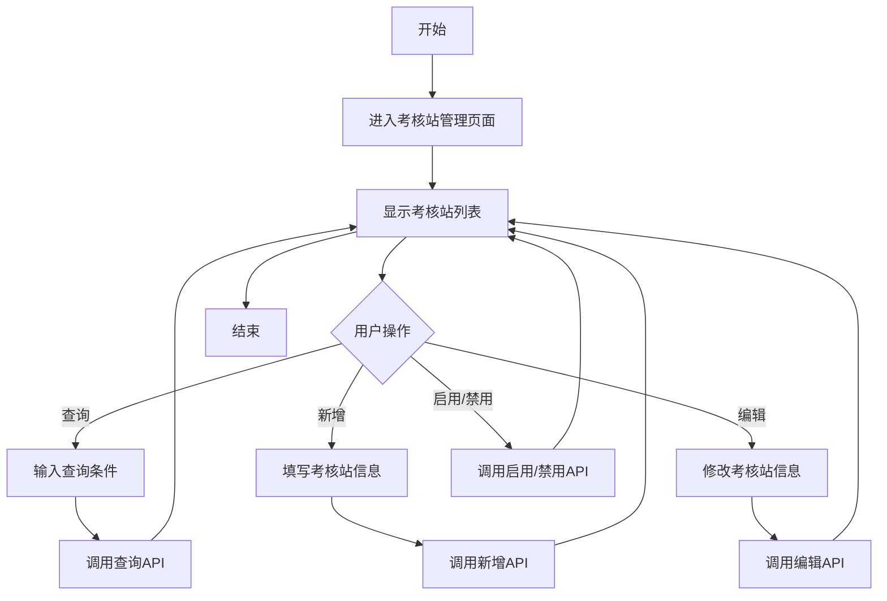
```mermaid
flowchart TD
    A[开始] --> B[进入考核站管理页面]
    B --> C[显示考核站列表]
    C --> D{用户操作}
    D -->|查询| E[输入查询条件] --> F[调用查询API] --> C
    D -->|新增| G[填写考核站信息] --> H[调用新增API] --> C
    D -->|编辑| I[修改考核站信息] --> J[调用编辑API] --> C
    D -->|启用/禁用| K[调用启用/禁用API] --> C
    C --> L[结束]
```

##### 4.1.2.4 状态转换图

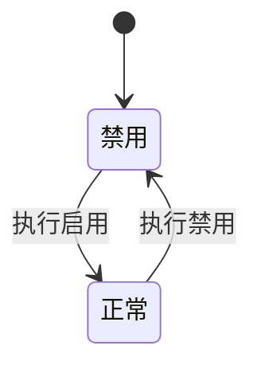
```mermaid
stateDiagram
    [*] --> 禁用
    禁用 --> 正常 : 执行启用
    正常 --> 禁用 : 执行禁用
```

##### 4.1.2.5 规则校验

| 校验规则 | 适用功能点 | 错误提示 |
|---------|----------|----------|
| 考核站名称必填 | 考核站新增、编辑 | 请输入考核站名称 |

---

#### 4.1.3 模块3：字典管理

##### 4.1.3.1 模块概述
- **模块定位**：提供职业（工种）、技能等级、题型类别等基础数据管理。
- **核心职责**：字典的增删改查。
- **依赖关系**：为账号管理、组卷管理等提供基础数据。
- **前端组件**：`views/DictionaryManagement.vue`；activeView：`字典管理`。

##### 4.1.3.2 功能详细设计

| 功能点 | 描述 | 流程ID | 界面ID | API ID | 可见角色 |
|-------|------|--------|--------|--------|----------|
| 职业（工种）管理 | 查看、新增、编辑、删除，支持按名称搜索 | FLW-DIC-001 | PAGE-DIC-001 | API-DIC-001 | 管理(5)、总管理(6) |
| 技能等级管理 | 同上 | FLW-DIC-002 | PAGE-DIC-002 | API-DIC-002 | 管理(5)、总管理(6) |
| 题型类别管理 | 同上 | FLW-DIC-003 | PAGE-DIC-003 | API-DIC-003 | 管理(5)、总管理(6) |

##### 4.1.3.3 流程图

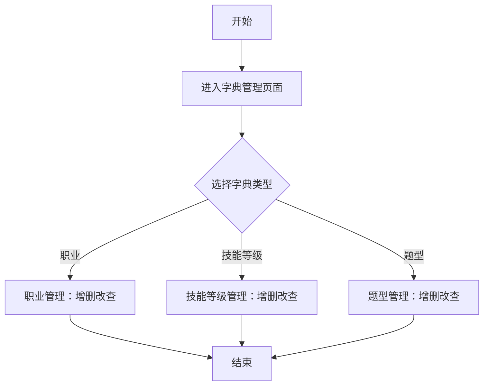
```mermaid
flowchart TD
    A[开始] --> B[进入字典管理页面]
    B --> C{选择字典类型}
    C -->|职业| D[职业管理：增删改查]
    C -->|技能等级| E[技能等级管理：增删改查]
    C -->|题型| F[题型管理：增删改查]
    D --> G[结束]
    E --> G
    F --> G
```

---

#### 4.1.4 模块4：部门管理

##### 4.1.4.1 模块概述
- **模块定位**：部门树形结构管理，确保组织架构清晰。
- **核心职责**：部门增删改、层级管理。
- **依赖关系**：为账号管理提供部门信息。
- **前端组件**：`views/department/DepartmentManagement.vue`；activeView：`部门管理`。

##### 4.1.4.2 功能详细设计

| 功能点 | 描述 | 流程ID | 界面ID | API ID | 可见角色 |
|-------|------|--------|--------|--------|----------|
| 部门列表查询 | 树形展示部门编码、名称、层级、排序、状态 | FLW-DEP-001 | PAGE-DEP-001 | API-DEP-001 | 管理(5)、总管理(6) |
| 部门新增 | 上级部门、部门编码、部门名称、排序、状态、描述 | FLW-DEP-002 | PAGE-DEP-002 | API-DEP-002 | 管理(5)、总管理(6) |
| 部门编辑 | 同上 | FLW-DEP-003 | PAGE-DEP-003 | API-DEP-003 | 管理(5)、总管理(6) |
| 部门删除 | 删除部门 | FLW-DEP-004 | PAGE-DEP-001 | API-DEP-004 | 管理(5)、总管理(6) |

##### 4.1.4.3 流程图

```mermaid
flowchart TD
    A[开始] --> B[进入部门管理页面]
    B --> C[显示部门树]
    C --> D{用户操作}
    D -->|新增| E[填写部门信息] --> F[调用新增API] --> C
    D -->|编辑| G[修改部门信息] --> H[调用编辑API] --> C
    D -->|删除| I[调用删除API] --> C
    C --> J[结束]
```

##### 4.1.4.4 状态转换图

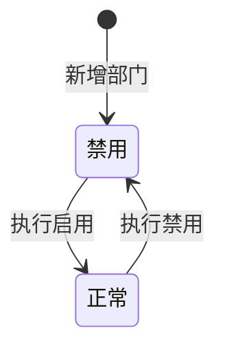
```mermaid
stateDiagram
    [*] --> 禁用 : 新增部门
    禁用 --> 正常 : 执行启用
    正常 --> 禁用 : 执行禁用
```

---

#### 4.1.5 模块5：组卷规则

##### 4.1.5.1 模块概述
- **模块定位**：组卷规则配置，确保组卷规范一致。
- **核心职责**：规则增删改查，类型（ruleType 0/1/2）、达标分数（passScore）、是否默认。
- **依赖关系**：为组卷管理提供规则支持。
- **前端组件**：`views/questionGroupRule/QuestionGroupRule.vue`、`RuleDialog.vue`；activeView：`组卷规则`。

##### 4.1.5.2 功能详细设计

| 功能点 | 描述 | 流程ID | 界面ID | API ID | 可见角色 |
|-------|------|--------|--------|--------|----------|
| 规则列表查询 | 显示ID、技能等级、职业道德、基础知识、专业知识、类型、默认、达标分数、备注。类型：职业认定(0)、竞赛(1)、模拟考核(2) | FLW-RUL-001 | PAGE-RUL-001 | API-RUL-001 | 管理(5)、总管理(6) |
| 规则新增 | 技能等级、类型、达标分数、默认、题型占比等 | FLW-RUL-002 | PAGE-RUL-002 | API-RUL-002 | 管理(5)、总管理(6) |
| 规则编辑 | 同上 | FLW-RUL-003 | PAGE-RUL-003 | API-RUL-003 | 管理(5)、总管理(6) |
| 规则删除 | 删除规则 | FLW-RUL-004 | PAGE-RUL-001 | API-RUL-004 | 管理(5)、总管理(6) |

##### 4.1.5.3 流程图

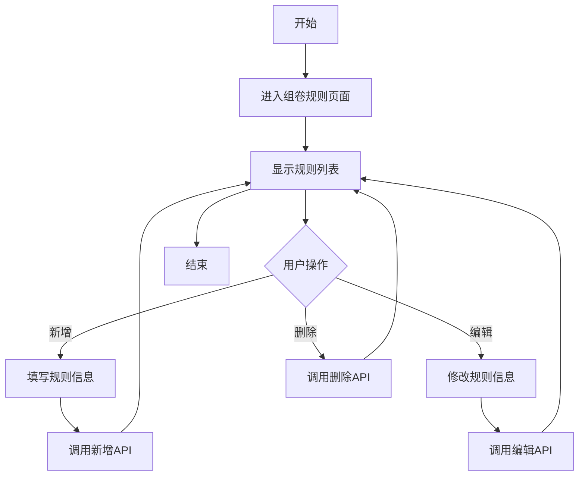
```mermaid
flowchart TD
    A[开始] --> B[进入组卷规则页面]
    B --> C[显示规则列表]
    C --> D{用户操作}
    D -->|新增| E[填写规则信息] --> F[调用新增API] --> C
    D -->|编辑| G[修改规则信息] --> H[调用编辑API] --> C
    D -->|删除| I[调用删除API] --> C
    C --> J[结束]
```

---

#### 4.1.6 模块6：资源题库

##### 4.1.6.1 模块概述
- **模块定位**：题库与题目管理，支持导入、查看、新增题目。
- **核心职责**：题库导入、题库查看、题库删除、题目新增。
- **依赖关系**：依赖字典管理、考核站管理；为组卷管理提供题目。
- **前端组件**：`views/BasicExamManage.vue`、`question/QuestionList.vue`、`question/QuestionTable.vue`、`question/ImportQuestion.vue` 等；activeView：`资源题库`。

##### 4.1.6.2 功能详细设计

| 功能点 | 描述 | 流程ID | 界面ID | API ID | 可见角色 |
|-------|------|--------|--------|--------|----------|
| 题库列表查询 | 按职业、技能等级、题库类型查询，题库类型：竞赛/模拟考试/职业认定。显示题库名称、类型、职业、技能等级、考核站、管理人、创建时间 | FLW-QST-001 | PAGE-QST-001 | API-QST-001 | 管理(5)、总管理(6)、命题(2)、审题(3)、考核站(4) |
| 题库导入 | 题库名称、题库类型、职业、技能等级、上传题目/答案。考核站只可导入竞赛题库 | FLW-QST-002 | PAGE-QST-002 | API-QST-002 | 管理(5)、总管理(6)、考核站(4) |
| 题库查看 | 查看题库中的题目 | FLW-QST-003 | PAGE-QST-003 | API-QST-003 | 同上 |
| 题库删除 | 删除题库 | FLW-QST-004 | PAGE-QST-001 | API-QST-004 | 管理(5)、总管理(6) |
| 题库新增题目 | 在题库中新增题目。考核站只在竞赛题库中新增 | FLW-QST-005 | PAGE-QST-003 | API-QST-005 | 同上 |

##### 4.1.6.3 流程图

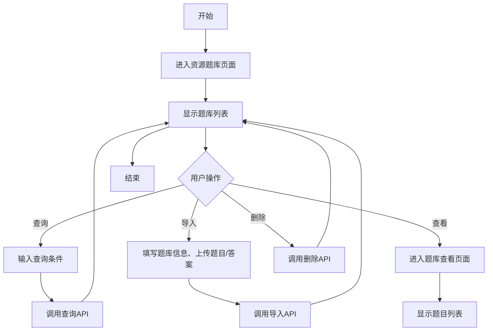
```mermaid
flowchart TD
    A[开始] --> B[进入资源题库页面]
    B --> C[显示题库列表]
    C --> D{用户操作}
    D -->|查询| E[输入查询条件] --> F[调用查询API] --> C
    D -->|导入| G[填写题库信息、上传题目/答案] --> H[调用导入API] --> C
    D -->|查看| I[进入题库查看页面] --> J[显示题目列表]
    D -->|删除| K[调用删除API] --> C
    C --> L[结束]
```

---

#### 4.1.7 模块7：组卷管理

##### 4.1.7.1 模块概述
- **模块定位**：试卷生成与管理，支持自动/手动组卷、提交审卷、批量派发。
- **核心职责**：自动组卷、手动组卷、提交审卷、试卷审核、批量派发。
- **依赖关系**：依赖资源题库、组卷规则、考核站管理。
- **前端组件**：`views/new/PaperManagement2.vue`、`AutoPaperModal.vue`、`ManualPaperPage.vue` 等；activeView：`手动组卷`。

##### 4.1.7.2 功能详细设计

| 功能点 | 描述 | 流程ID | 界面ID | API ID | 可见角色 |
|-------|------|--------|--------|--------|----------|
| 试卷列表查询 | 按职业、技能等级、创建时间、审核状态查询，显示名称、试卷ID、职业、技能等级、创建人、考核站、创建时间、审核状态、试卷用途(ruleType) | FLW-PAP-001 | PAGE-PAP-001 | API-PAP-001 | 管理(5)、总管理(6)、考核站(4)、审卷(8)、组卷(7) |
| 自动组卷 | 卷子名称、卷子类型(ruleType)、考核站、职业、技能等级、难易度、题型配置。考核站只可组竞赛试卷 | FLW-PAP-002 | PAGE-PAP-002 | API-PAP-002 | 管理(5)、总管理(6)、考核站(4) |
| 手动组卷 | 卷子名称、卷子类型、考核站、职业、技能等级、题库选题、每题分数等 | FLW-PAP-003 | PAGE-PAP-003 | API-PAP-003 | 同上 |
| 提交审卷 | 将试卷状态更新为待审核 | FLW-PAP-004 | PAGE-PAP-001 | API-PAP-004 | 同上 |
| 试卷审核 | 审卷专家：查看、下载、通过、驳回 | FLW-PAP-005 | PAGE-PAP-004 | API-PAP-005 | 审卷专家(8) |
| 试卷下载 | 下载试卷 | FLW-PAP-006 | PAGE-PAP-001 | API-PAP-006 | 管理(5)、总管理(6)、考核站(4) |
| 试卷删除 | 删除试卷 | FLW-PAP-007 | PAGE-PAP-001 | API-PAP-007 | 管理(5)、总管理(6) |
| 批量派发 | 按考核站、考试申请批量派发试卷 | FLW-PAP-008 | PAGE-PAP-001 | API-PAP-008 | 管理(5)、总管理(6) |

##### 4.1.7.3 流程图

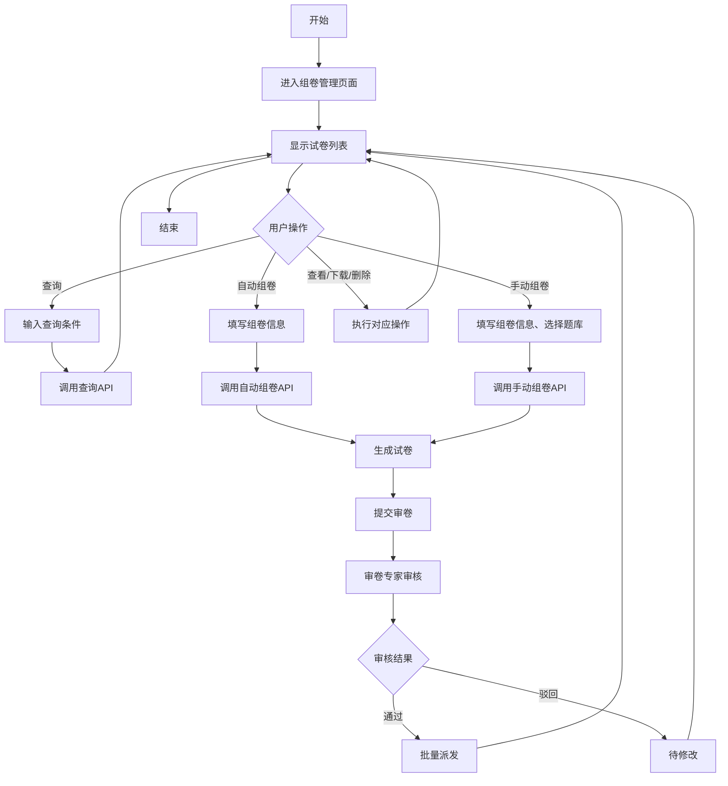
```mermaid
flowchart TD
    A[开始] --> B[进入组卷管理页面]
    B --> C[显示试卷列表]
    C --> D{用户操作}
    D -->|查询| E[输入查询条件] --> F[调用查询API] --> C
    D -->|自动组卷| G[填写组卷信息] --> H[调用自动组卷API] --> I[生成试卷]
    D -->|手动组卷| J[填写组卷信息、选择题库] --> K[调用手动组卷API] --> I
    I --> L[提交审卷]
    L --> M[审卷专家审核]
    M --> N{审核结果}
    N -->|通过| O[批量派发]
    N -->|驳回| P[待修改]
    O --> C
    P --> C
    D -->|查看/下载/删除| Q[执行对应操作] --> C
    C --> R[结束]
```

##### 4.1.7.4 状态转换图

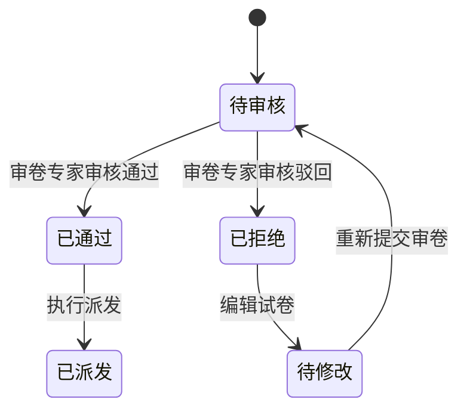
```mermaid
stateDiagram
    [*] --> 待审核
    待审核 --> 已通过 : 审卷专家审核通过
    待审核 --> 已拒绝 : 审卷专家审核驳回
    已通过 --> 已派发 : 执行派发
    已拒绝 --> 待修改 : 编辑试卷
    待修改 --> 待审核 : 重新提交审卷
```

##### 4.1.7.5 规则校验

| 校验规则 | 适用功能点 | 错误提示 |
|---------|----------|----------|
| 卷子名称必填 | 自动组卷、手动组卷 | 请输入卷子名称 |
| 卷子类型必填 | 自动组卷、手动组卷 | 请选择卷子类型 |
| 考核站必填 | 自动组卷、手动组卷 | 请选择考核站 |
| 职业（工种）必填 | 自动组卷、手动组卷 | 请选择职业（工种） |
| 技能等级必填 | 自动组卷、手动组卷 | 请选择技能等级 |

---

#### 4.1.8 模块8：考试管理

##### 4.1.8.1 模块概述
- **模块定位**：考试全生命周期管理，含考试列表、派发记录、报考人员。
- **核心职责**：考试增删改查、派发记录（①试卷申请 ②派发记录 ③批量派发）、报考人员管理、试卷派发。
- **依赖关系**：依赖组卷管理、考核站管理、试卷申请、职工列表。
- **前端组件**：`views/exam/ExamManagement.vue`、`exam/ExamDispatchPage.vue`、`teachExam/ExamApplicants.vue`；activeView：`考试管理`。

##### 4.1.8.2 功能详细设计

| 功能点 | 描述 | 流程ID | 界面ID | API ID | 可见角色 |
|-------|------|--------|--------|--------|----------|
| 考试列表查询 | 按考试名称、状态查询，显示考试名称、职业、技能等级、开始/结束时间、考试时长、关联试卷、考试类型、考试模式、状态、考试人数。点击考试人数进入报考人员管理 | FLW-EXA-001 | PAGE-EXA-001 | API-EXA-001 | 管理(5)、总管理(6)、考核站(4) |
| 考试新增 | 考试名称、职业、技能等级、考试用途、考试类型、**所属考核站（管理/总管理必填，调用考核站接口）**、试卷名称（须先选考核站后加载）、开始/结束时间、考试时长、考试描述。管理(5)/总管理(6)提交时传 stationId(Long)；考核站(4)同原有逻辑 | FLW-EXA-002 | PAGE-EXA-002 | API-EXA-002 | 管理(5)、总管理(6)、考核站(4) |
| 考试编辑 | 同上；管理/总管理可修改所属考核站，修改考核站后关联试卷重新按新考核站加载 | FLW-EXA-003 | PAGE-EXA-003 | API-EXA-003 | 管理(5)、总管理(6)、考核站(4) |
| 关联试卷 | 线下考试关联已审核通过的试卷。管理/总管理须先选择所属考核站，再按所选考核站加载试卷列表（listPapersForExamRecord 入参 stationId 取表单所选考核站） | FLW-EXA-004 | PAGE-EXA-003 | API-EXA-004 | 管理(5)、总管理(6)、考核站(4) |
| 派发记录查询 | ①试卷申请列表（查看/下载）②派发记录 ③批量派发。考核站视角：查看/下载接收的试卷 | FLW-EXA-007 | PAGE-EXA-005 | API-EXA-007 | 管理(5)、总管理(6)、考核站(4) |
| 报考人员管理 | 新增、导入、删除、查询。管理(5)/总管理(6)新增或导入时须先选择所属考核站；考核站(4)使用当前考核站。职工编号须存在。支持下载模板 | FLW-EXA-006 | PAGE-EXA-004 | API-EXA-006 | 管理(5)、总管理(6)、考核站(4) |
| 试卷派发 | 线上考试派发试卷 | FLW-EXA-012 | PAGE-EXA-005 | API-EXA-012 | 考核站(4) |
| 加密试卷包下载 | 下载加密后的试卷压缩包（ZIP格式） | FLW-EXA-010 | PAGE-EXA-005 | API-EXA-010 | 考核站(4) |
| 解压密码查看 | 查看解压密码，仅首次可查看明文，查看后标记为已查看 | FLW-EXA-011 | PAGE-EXA-005 | API-EXA-011 | 考核站(4) |

##### 4.1.8.3 试卷加密与密码管理（如已实现）

| 项目 | 说明 |
|------|------|
| 密码生成规则 | 长度8位，包含大写字母(A-Z) + 小写字母(a-z) + 数字(0-9) |
| 密码存储 | AES 加密，密文存储到数据库 |
| 压缩包加密 | 格式：ZIP，ZIP 标准加密 |
| 密码查看 | 仅首次可查看明文，再次查看时提示「密码已查看，请联系管理员重新派发」 |

##### 4.1.8.4 规则校验

| 校验规则 | 适用功能点 | 错误提示 | 输入限制 |
|---------|----------|----------|----------|
| 考试名称必填 | 考试新增、编辑 | 请输入考试名称 | 必填，最大长度100字符 |
| 所属考核站必填 | 考试新增、编辑（仅管理/总管理） | 请选择考核站 | 管理(5)/总管理(6)必填，接口 add/update 传 stationId(Long) |
| 职业（工种）必填 | 考试新增、编辑 | 请选择职业（工种） | 必填 |
| 技能等级必填 | 考试新增、编辑 | 请选择技能等级 | 必填 |
| 考试时长必填 | 考试新增、编辑 | 请输入考试时长 | 必填，范围1-300分钟 |
| 考试结束时间 | 考试新增、编辑 | 结束时间须晚于开始时间 | 结束时间 > 开始时间 |
| 职工编号必须存在 | 考试人员新增 | 该职工编号不存在，请先添加职工 | - |
| 导入文件大小 | 考试人员导入 | 文件过大，请分批导入 | 最大10MB |

##### 4.1.8.5 流程图

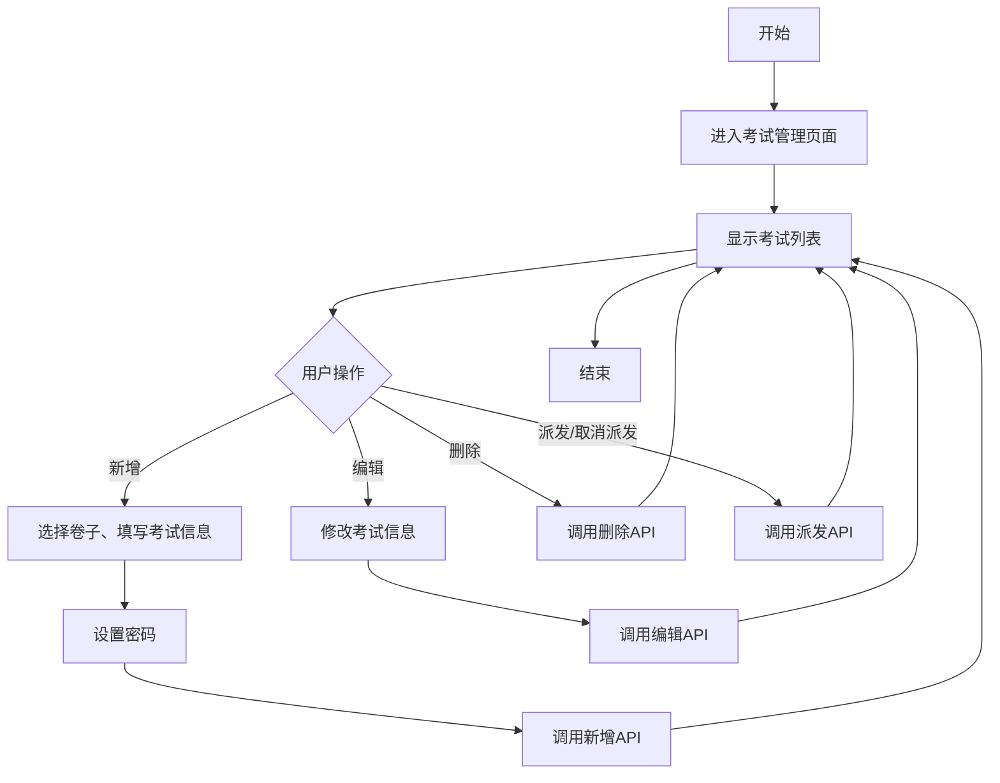
```mermaid
flowchart TD
    A[开始] --> B[进入考试管理页面]
    B --> C[显示考试列表]
    C --> D{用户操作}
    D -->|新增| E[选择卷子、填写考试信息] --> F[设置密码] --> G[调用新增API] --> C
    D -->|编辑| H[修改考试信息] --> I[调用编辑API] --> C
    D -->|删除| J[调用删除API] --> C
    D -->|派发/取消派发| K[调用派发API] --> C
    C --> L[结束]
```

---

#### 4.1.9 模块9：试卷申请

##### 4.1.9.1 模块概述
- **模块定位**：考核站发起试卷申请，上传考试列表、备注。
- **核心职责**：试卷申请新增、查看、删除。
- **依赖关系**：依赖考核站管理。
- **前端组件**：`views/paperApplication/PaperApplication.vue`；activeView：`试卷申请`。

##### 4.1.9.2 功能详细设计

| 功能点 | 描述 | 流程ID | 界面ID | API ID | 可见角色 |
|-------|------|--------|--------|--------|----------|
| 试卷申请新增 | 上传考试列表（xlsx、doc、docx、pdf，最大10MB）、备注说明（最多500字） | FLW-APP-001 | PAGE-APP-001 | API-APP-001 | 管理(5)、总管理(6)、考核站(4) |
| 试卷申请查看 | 查看申请列表 | FLW-APP-002 | PAGE-APP-001 | API-APP-002 | 同上 |
| 试卷申请删除 | 删除申请（未派发时） | FLW-APP-003 | PAGE-APP-001 | API-APP-003 | 同上 |

##### 4.1.9.3 规则校验

| 校验规则 | 适用功能点 | 错误提示 | 输入限制 |
|---------|----------|----------|----------|
| 附件必填 | 试卷申请新增 | 请上传考试列表文件 | 必填 |
| 附件格式 | 试卷申请新增 | 仅支持xlsx、doc、docx、pdf | 支持格式：xlsx、doc、docx、pdf |
| 附件大小 | 试卷申请新增 | 附件过大，请压缩后上传 | 最大10MB |
| 备注长度 | 试卷申请新增 | 备注过长 | 最大500字符 |

##### 4.1.9.4 流程图

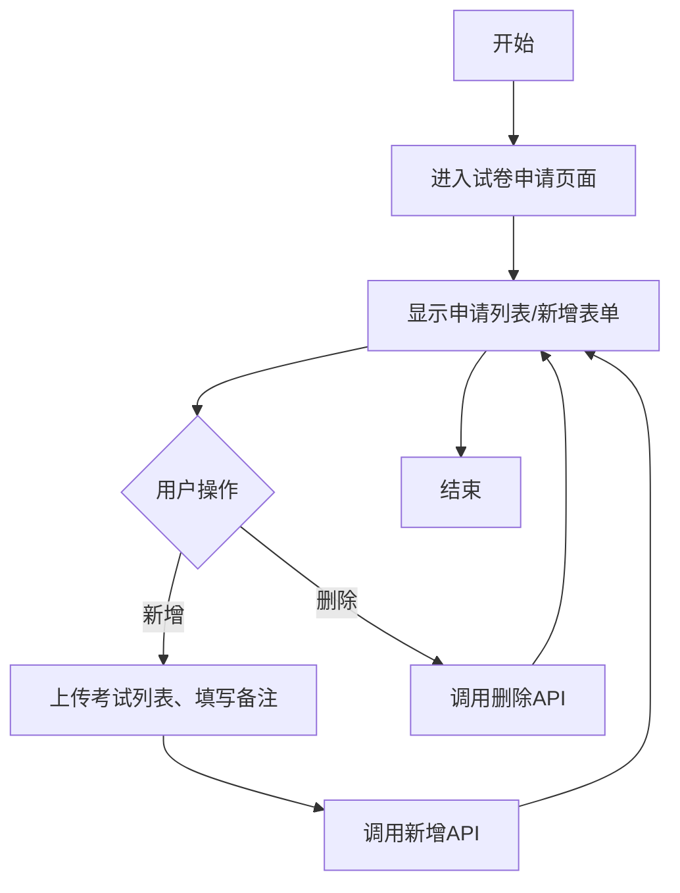
```mermaid
flowchart TD
    A[开始] --> B[进入试卷申请页面]
    B --> C[显示申请列表/新增表单]
    C --> D{用户操作}
    D -->|新增| E[上传考试列表、填写备注] --> F[调用新增API] --> C
    D -->|删除| G[调用删除API] --> C
    C --> H[结束]
```

##### 4.1.9.5 状态转换图

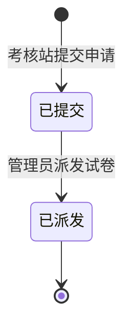
```mermaid
stateDiagram
    [*] --> 已提交 : 考核站提交申请
    已提交 --> 已派发 : 管理员派发试卷
    已派发 --> [*]
```

---

#### 4.1.10 模块10：考核成绩

##### 4.1.10.1 模块概述
- **模块定位**：成绩管理，支持线上判分、线下成绩导入、成绩分析。
- **核心职责**：成绩列表、判分、成绩导入、成绩分析。
- **依赖关系**：依赖考试管理、职工列表。
- **前端组件**：`views/StudentScore.vue`、`studentScore/StudentDetail.vue`、`ExamAnalysis.vue`；activeView：`查看成绩`。

##### 4.1.10.2 功能详细设计

| 功能点 | 描述 | 流程ID | 界面ID | API ID | 可见角色 |
|-------|------|--------|--------|--------|----------|
| 成绩列表查询 | 按名称、起止日期查询，显示考试名称、考试模式、总报名人数、通过人数、考试时长、开始/结束时间 | FLW-SCO-001 | PAGE-SCO-001 | API-SCO-001 | 所有角色 |
| 成绩详情查看 | 查看工号、姓名、部门、技能等级、考核站、理论成绩、实践成绩、总成绩、是否通过 | FLW-SCO-002 | PAGE-SCO-002 | API-SCO-002 | 管理(5)、总管理(6)、考核站(4) |
| 线上判分 | 阅卷专家对线上考试判分，已判(蓝)/未判(红)状态 | FLW-SCO-004 | PAGE-SCO-002 | API-SCO-004 | 阅卷专家(1) |
| 线下成绩导入 | 职业认定：理论+实践；竞赛/模拟考核：总成绩 | FLW-SCO-003 | PAGE-SCO-003 | API-SCO-003 | 阅卷专家(1) |
| 成绩分析 | 平均分、最高分、最低分、通过率等 | FLW-SCO-005 | PAGE-SCO-004 | API-SCO-005 | 管理(5)、总管理(6)、考核站(4)、阅卷(1) |

##### 4.1.10.3 流程图

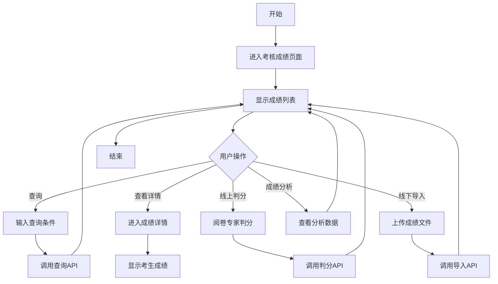
```mermaid
flowchart TD
    A[开始] --> B[进入考核成绩页面]
    B --> C[显示成绩列表]
    C --> D{用户操作}
    D -->|查询| E[输入查询条件] --> F[调用查询API] --> C
    D -->|查看详情| G[进入成绩详情] --> H[显示考生成绩]
    D -->|线上判分| I[阅卷专家判分] --> J[调用判分API] --> C
    D -->|线下导入| K[上传成绩文件] --> L[调用导入API] --> C
    D -->|成绩分析| M[查看分析数据] --> C
    C --> N[结束]
```

##### 4.1.10.4 成绩录入规则

**职业认定考试成绩结构**
| 成绩类型 | 是否必填 | 说明 |
|----------|----------|------|
| 理论成绩 | 是 | 理论知识考试成绩 |
| 实践成绩 | 是 | 实践操作考试成绩 |
| 总成绩 | 自动计算 | 理论和实践加和 |
| 是否通过 | 人工判断 | 点击通过按钮 |

**其他类型考试成绩结构（竞赛、模拟考核）**
| 成绩类型 | 是否必填 | 说明 |
|----------|----------|------|
| 总成绩 | 是 | 考试总成绩，满分100分 |
| 是否通过 | 人工判断 | 点击通过按钮 |

##### 4.1.10.5 规则校验

| 校验规则 | 适用功能点 | 错误提示 | 输入限制 |
|---------|----------|----------|----------|
| 理论成绩必填 | 职业认定成绩录入 | 请输入理论成绩 | 必填，范围0-100分 |
| 实践成绩必填 | 职业认定成绩录入 | 请输入实践成绩 | 必填，范围0-100分 |
| 总成绩必填 | 其他类型成绩录入 | 请输入总成绩 | 必填，范围0-100分 |
| 导入文件大小 | 成绩导入 | 文件过大，请分批导入 | 最大10MB |

---

#### 4.1.11 模块11：证书管理

##### 4.1.11.1 模块概述
- **模块定位**：证书录入与发放状态管理。
- **核心职责**：证书新增、编辑、删除、标记已邮寄、确认收到。
- **依赖关系**：依赖考核成绩（工号来源于成绩管理）、考核站管理。
- **前端组件**：`views/certificate/CertificateManagement.vue`；activeView：`证书管理`。

##### 4.1.11.2 工号来源说明

| 字段 | 来源 | 说明 |
|------|------|------|
| 工号 | 成绩管理模块 | 证书中的工号来源于成绩管理中考试通过的职工编号，即只有通过考试且成绩合格的职工才能生成对应证书 |

**证书生成规则**：管理员新增证书时，输入的工号必须是成绩管理中已存在且考试通过的职工编号；系统根据工号自动获取职工相关信息；如工号不存在或未通过考试，提示「该工号无有效考试成绩，无法生成证书」。

##### 4.1.11.3 功能详细设计

| 功能点 | 描述 | 流程ID | 界面ID | API ID | 可见角色 |
|-------|------|--------|--------|--------|----------|
| 证书列表查询 | 按证书编号、姓名、状态、考核站、考试名称等查询，显示序号、证书编号、姓名、工号、考试名称、考核站、状态、发证日期、下证日期、有效期、快递单号、邮寄时间、接收时间、备注 | FLW-CER-001 | PAGE-CER-001 | API-CER-001 | 管理(5)、总管理(6)、考核站(4) |
| 证书新增 | 证书编号、姓名、工号、考试名称、考核站、发证日期、下证日期、有效期、备注。新增后状态为已录入(0) | FLW-CER-002 | PAGE-CER-002 | API-CER-002 | 管理(5)、总管理(6) |
| 证书编辑 | 同上 | FLW-CER-003 | PAGE-CER-003 | API-CER-003 | 管理(5)、总管理(6) |
| 证书删除 | 删除证书 | FLW-CER-004 | PAGE-CER-001 | API-CER-004 | 管理(5)、总管理(6) |
| 标记已邮寄 | 输入快递单号、备注，状态变更为已邮寄(1) | FLW-CER-005 | PAGE-CER-001 | API-CER-005 | 管理(5)、总管理(6) |
| 确认收到 | 考核站确认收货，状态变更为已收到(2) | FLW-CER-006 | PAGE-CER-001 | API-CER-006 | 考核站(4) |

##### 4.1.11.4 规则校验

| 校验规则 | 适用功能点 | 错误提示 | 输入限制 |
|---------|----------|----------|----------|
| 工号必须存在且考试通过 | 证书新增 | 该工号无有效考试成绩，无法生成证书 | - |
| 证书编号必填 | 证书新增、编辑 | 请输入证书编号 | 必填，最大长度100字符 |
| 工号必填 | 证书新增 | 请输入工号 | 必填，最大长度50字符 |
| 发证日期必填 | 证书新增、编辑 | 请选择发证日期 | 必填 |
| 有效期必填 | 证书新增、编辑 | 请输入有效期 | 必填 |
| 备注长度 | 证书新增、编辑、标记已邮寄 | 备注过长 | 最大500字符 |

##### 4.1.11.5 流程图

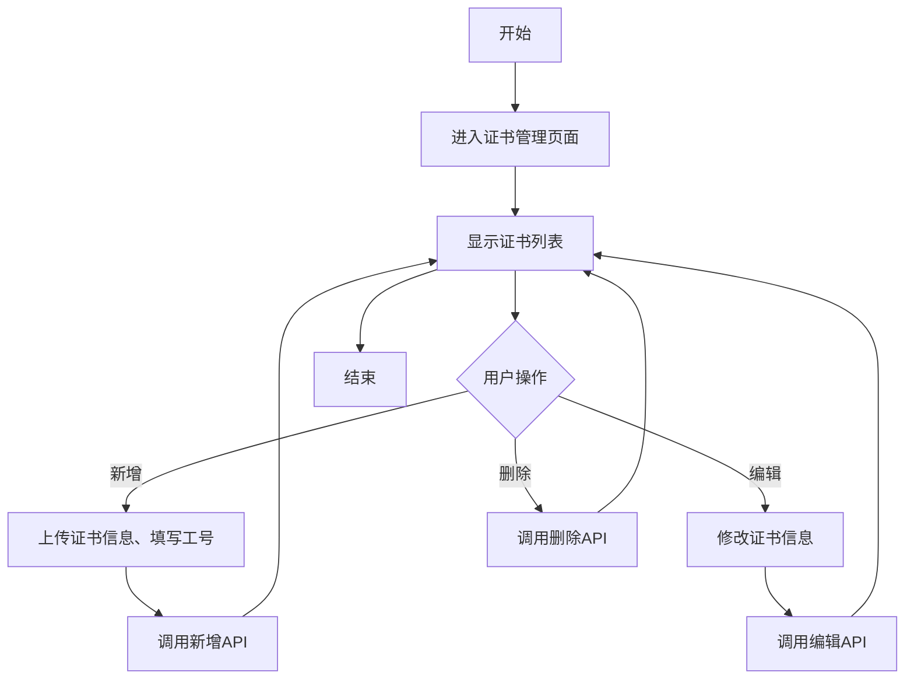
```mermaid
flowchart TD
    A[开始] --> B[进入证书管理页面]
    B --> C[显示证书列表]
    C --> D{用户操作}
    D -->|新增| E[上传证书信息、填写工号] --> F[调用新增API] --> C
    D -->|编辑| G[修改证书信息] --> H[调用编辑API] --> C
    D -->|删除| I[调用删除API] --> C
    C --> J[结束]
```

##### 4.1.11.6 状态转换图

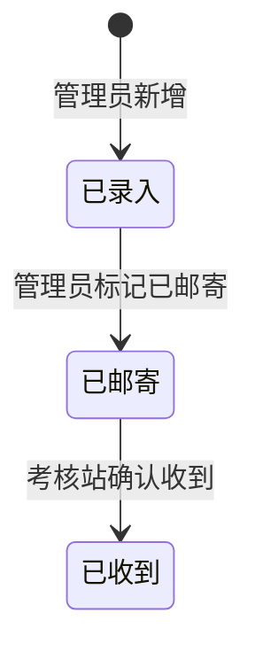
```mermaid
stateDiagram
    [*] --> 已录入 : 管理员新增
    已录入 --> 已邮寄 : 管理员标记已邮寄
    已邮寄 --> 已收到 : 考核站确认收到
```

---

#### 4.1.12 模块12：技能考核

##### 4.1.12.1 模块概述
- **模块定位**：技能考核试卷上传与管理。
- **核心职责**：技能考核上传、查看、下载、删除。
- **依赖关系**：依赖考核站管理。
- **前端组件**：`views/SkillExam.vue`；activeView：`技能考核`。

##### 4.1.12.2 功能详细设计

| 功能点 | 描述 | 流程ID | 界面ID | API ID | 可见角色 |
|-------|------|--------|--------|--------|----------|
| 技能考核列表查询 | 按考核站、考试类型查询，显示序号、考核站、考试类型、考试时间、考试名称、上传人 | FLW-SKI-001 | PAGE-SKI-001 | API-SKI-001 | 管理(5)、总管理(6) |
| 技能考核上传 | 考试名称、考核站、考试类型、考试时间、上传试卷文件 | FLW-SKI-002 | PAGE-SKI-002 | API-SKI-002 | 管理(5)、总管理(6) |
| 技能考核查看 | 查看试卷 | FLW-SKI-003 | PAGE-SKI-003 | API-SKI-003 | 管理(5)、总管理(6) |
| 技能考核下载 | 下载试卷 | FLW-SKI-004 | PAGE-SKI-001 | API-SKI-004 | 管理(5)、总管理(6) |
| 技能考核删除 | 删除 | FLW-SKI-005 | PAGE-SKI-001 | API-SKI-005 | 管理(5)、总管理(6) |

##### 4.1.12.3 流程图

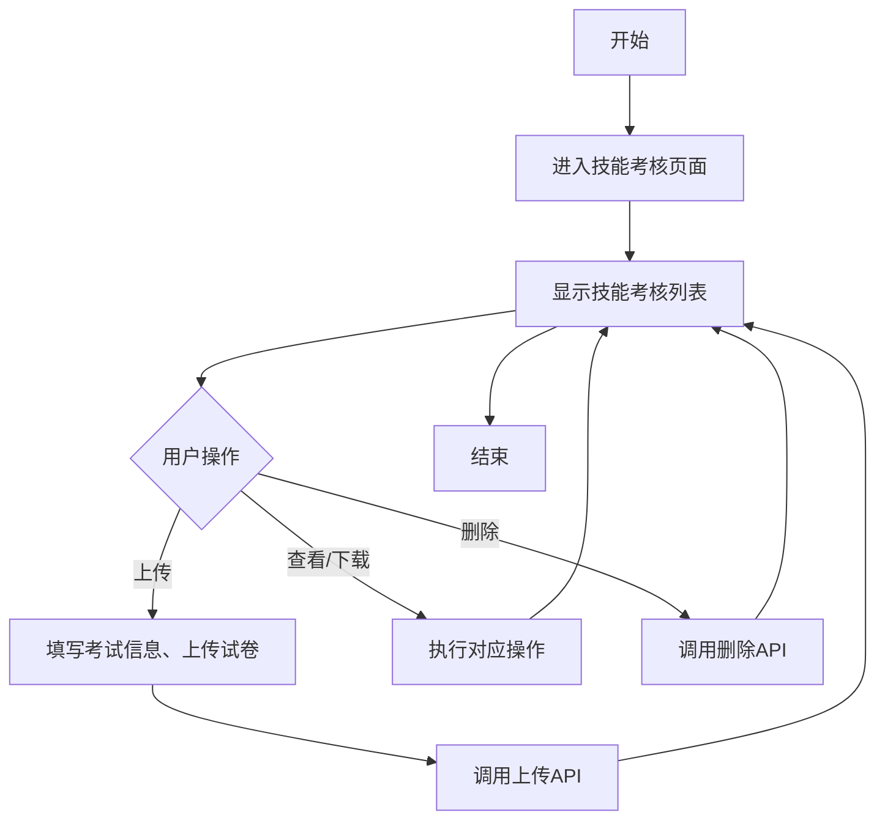
```mermaid
flowchart TD
    A[开始] --> B[进入技能考核页面]
    B --> C[显示技能考核列表]
    C --> D{用户操作}
    D -->|上传| E[填写考试信息、上传试卷] --> F[调用上传API] --> C
    D -->|查看/下载| G[执行对应操作] --> C
    D -->|删除| H[调用删除API] --> C
    C --> I[结束]
```

---

#### 4.1.13 模块13：日志监控

##### 4.1.13.1 模块概述
- **模块定位**：操作日志查询与监控。
- **核心职责**：按操作人查看日志详情。
- **依赖关系**：无直接业务依赖。
- **前端组件**：`views/OperationLog.vue`；activeView：`日志监控`。

##### 4.1.13.2 功能详细设计

| 功能点 | 描述 | 流程ID | 界面ID | API ID | 可见角色 |
|-------|------|--------|--------|--------|----------|
| 日志列表查询 | 显示操作人、角色、账号、详情。点击查看该操作人的具体日志（时间、动作） | FLW-LOG-001 | PAGE-LOG-001 | API-LOG-001 | 管理(5)、总管理(6) |

##### 4.1.13.3 流程图

```mermaid
flowchart TD
    A[开始] --> B[进入日志监控页面]
    B --> C[显示操作人列表]
    C --> D[选择操作人]
    D --> E[查看该操作人详细日志]
    E --> F[结束]
```

---

#### 4.1.14 模块14：个人中心

##### 4.1.14.1 模块概述
- **模块定位**：通用模块，为所有角色提供个人账号管理功能。
- **核心职责**：密码修改、退出登录。
- **依赖关系**：依赖账号管理模块。
- **前端入口**：Main.vue 顶部「个人中心」链接。

##### 4.1.14.2 功能详细设计

| 功能点 | 描述 | 流程ID | 界面ID | API ID | 可见角色 |
|-------|------|--------|--------|--------|----------|
| 个人中心页面 | 显示账号信息、密码修改、退出账号 | FLW-PRO-001 | PAGE-PRO-001 | API-PRO-001 | 所有角色 |
| 密码修改 | 原密码、新密码、确认新密码 | FLW-PRO-002 | PAGE-PRO-001 | API-PRO-002 | 所有角色 |
| 退出账号 | 安全退出当前登录状态 | FLW-PRO-003 | PAGE-PRO-001 | API-PRO-003 | 所有角色 |

---

#### 4.1.15 非菜单入口页面

| 页面名称 | 组件路径 | 入口方式 | 主要功能 |
|----------|----------|----------|----------|
| 报名人员管理 | `views/teachExam/ExamApplicants.vue` | 考试管理 → 点击考试人数 | 报名人员列表、新增/删除、导入、导出 |
| 考试试卷列表 | `views/teachExam/ExamPapers.vue` | 考试管理 → 点击考试人数 | 考试列表、报名人数入口 |
| 考核站派发 | `views/exam/ExamDistributePage.vue` | 路由 `/exam-distribute/:examId` | 选择试卷、编辑试题、派发到考核站 |
| 文件预览 | `views/FilePreview.vue` | 路由 `/preview` | 文档预览 |
| 登录页 | `views/Login.vue` | 路由 `/login` | 登录 |
| 主框架 | `views/Main.vue` | 路由 `/home` | 主布局、侧边栏、面包屑 |

---

## 五、核心业务时序图

### 5.1 主流程（申请→组卷→审卷→派发→阅卷→成绩→证书）

```mermaid
sequenceDiagram
    participant 考核站管理员
    participant 管理员
    participant 审卷专家
    participant 阅卷专家
    participant 系统

    考核站管理员->>系统: 1. 试卷申请（上传文件、备注）
    管理员->>系统: 2. 考试管理/派发①查看试卷申请
    管理员->>系统: 3. 组卷管理：自动/手动组卷
    管理员->>系统: 4. 提交审卷
    审卷专家->>系统: 5. 审核（通过/驳回）
    管理员->>系统: 6. 组卷管理/派发③批量派发
    考核站管理员->>系统: 7. 派发页面：查看/下载试卷
    阅卷专家->>系统: 8. 判分/导入成绩
    管理员->>系统: 9. 考核成绩：查看
    考核站管理员->>系统: 10. 考核成绩：查看
    管理员->>系统: 11. 证书管理：新增/管理
    考核站管理员->>系统: 12. 证书管理：确认收到
```

### 5.2 线下考试完整流程（含加密试卷包时）

```mermaid
sequenceDiagram
    participant 考核站管理员
    participant 管理员
    participant 审卷专家
    participant 阅卷专家
    participant 后端服务
    participant 系统

    考核站管理员->>后端服务: 提交试卷申请（上传附件）
    后端服务-->>考核站管理员: 申请提交成功
    管理员->>后端服务: 查看试卷申请
    管理员->>后端服务: 自动/手动组卷
    管理员->>后端服务: 提交审卷
    审卷专家->>后端服务: 审核（通过/驳回）
    管理员->>后端服务: 批量派发（生成加密试卷包）
    考核站管理员->>后端服务: 下载试卷包、查看解压密码
    阅卷专家->>后端服务: 导入线下成绩
    管理员->>后端服务: 查看成绩
    管理员->>后端服务: 新增证书
    考核站管理员->>后端服务: 确认证书收到
```

---

---

## 六、附录

### 6.1 前端技术约定

| 约定项 | 说明 |
|--------|------|
| 导航方式 | Main.vue 使用 activeView 切换组件，非 vue-router 路由 |
| 认证 | JWT Token 存 localStorage，请求头 `Authorization: Bearer {token}` |
| 图片接口 | `/exam/api/getImage?fileName=`，需带 Token；使用 AuthImage 或 fetchImageAsBlobUrl |
| 图片上传 | 题目/答案图片：`/api/uploadImage`（POST）；格式 JPG/PNG/GIF/BMP/WebP；最大 5MB。详见《图片上传功能说明》 |
| ruleType | 0=职业认定、1=竞赛、2=模拟考核，统一数值 |
| passScore | 组卷规则达标分数字段 |

### 6.2 关联文档

| 文档 | 用途 |
|------|------|
| list/功能与页面对应表.md | 菜单、activeView、组件路径、角色权限 |
| 规则/菜单与角色路由关系实现说明.md | 角色与菜单可见性 |
| 规则/考核业务梳理-角色模块与流程.md | 业务流程与模块对应 |
| 规则/中车2.0需求实现清单.md | 实现进度与验收 |
| 规则/需求1-29前端调整说明.md | 字段与前端改动细节 |
| 图片上传功能说明.md | 题目/答案图片上传接口、格式、大小限制、使用示例 |

---

**文档版本**：v2.3  
**创建日期**：2026-03-02  
**更新日期**：2026-03-02  
**更新说明（v2.3）**：① 账号管理-管理员新增：密码/确认密码默认 Aa123456，校验规则补充；② 报考人员管理：管理/总管理须先选所属考核站；③ 考试管理-新增/编辑：管理/总管理增加所属考核站必填、关联试卷先选考核站后加载、编辑可改考核站，add/update 传 stationId(Long)。  
**依据模板**：中车PRD_V2.md 目录与结构标准
